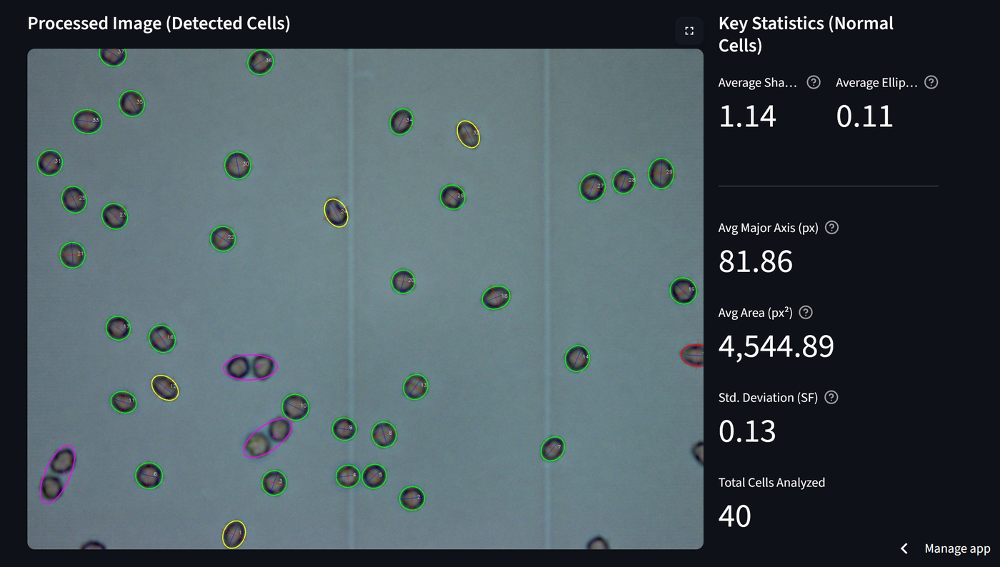
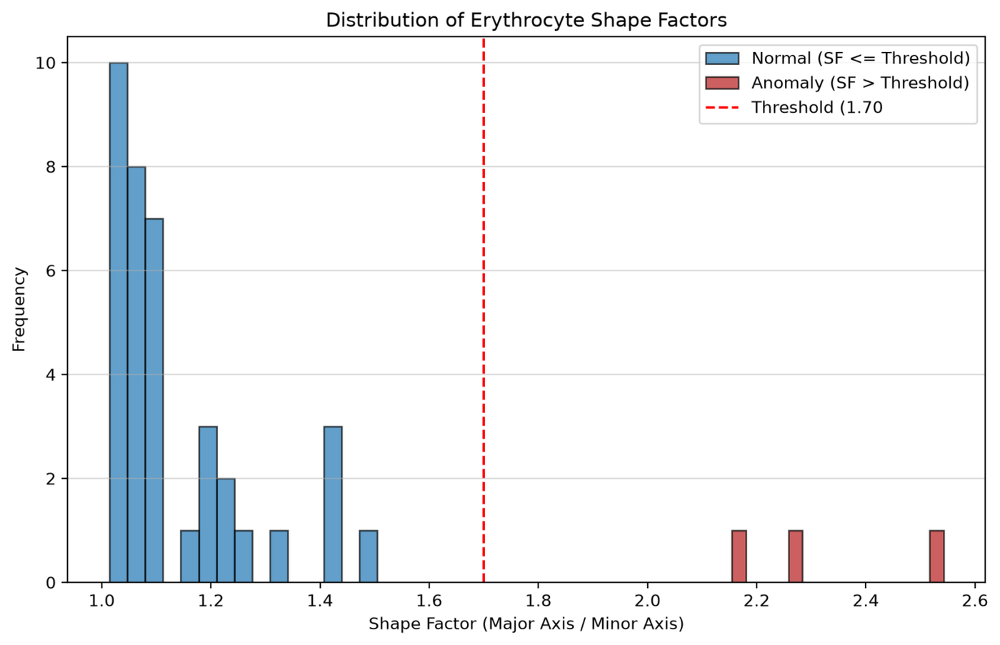

# 🔬 Erythrocyte Shape Analyzer

**Quantitative, image-based analysis of red blood cell morphology — built with Streamlit and OpenCV.**

🔗 **Live demo:** <a href="https://erythrocyte-shape-analyzer.streamlit.app" target="_blank" rel="noopener noreferrer">erythrocyte-shape-analyzer.streamlit.app</a>

---

## Overview

This tool automatically detects red blood cells (erythrocytes) in a microscope image and measures their shape using classical computer vision (contour detection + ellipse fitting). It calculates the **Shape Factor** (major axis / minor axis) for every detected cell — a quantitative measure of elongation — along with ellipticity, area, and perimeter, and flags cells above a user-defined anomaly threshold.

The project grew out of research on the acute effects of functionalized carbon nanotubes (MWCNTs-Ni) on erythrocyte function, where shape stability under toxic exposure is a key parameter (see [Research Context](#-research-context) below). The app is a standalone demonstration of that measurement methodology, built to be usable on any microscope image, not just the original dataset.

---

## 📸 Screenshots

**Detected cells with per-cell shape classification** (green = normal, yellow = moderately elongated, red = highly elongated, magenta = anomaly) alongside live statistics:



**Shape Factor vs. Area** — anomalies (red) separate cleanly from the normal population:


**Shape Factor distribution** across the analyzed sample:



---

## 🌟 Features

* **Automated RBC detection** — Otsu thresholding + contour detection + ellipse fitting, with a minimum-axis-size filter to reject segmentation artifacts.
* **Quantitative shape metrics** — Shape Factor, ellipticity, area, and perimeter per cell, with optional pixel → micrometer calibration.
* **Anomaly highlighting** — cells above a configurable Shape Factor threshold are marked in magenta and separated from the normal population.
* **Visual diagnostics** — annotated image with major/minor axes drawn per cell, plus a binary mask preview so you can sanity-check the segmentation.
* **Statistical reporting** — scatter plot (Shape Factor vs. Area), and histograms for Shape Factor, Area, and Perimeter distributions.
* **Data export** — full results table downloadable as CSV or Excel.

---

## 🧪 Methodology

1. Convert the image to grayscale and binarize it with **Otsu's method** (automatic threshold selection, robust to uneven illumination).
2. Detect external contours and filter out anything smaller than the configured minimum axis size (removes noise/debris).
3. Fit an ellipse to each remaining contour (`cv2.fitEllipse`) and compute **Shape Factor = major axis / minor axis**.
4. Classify each cell as normal or anomalous against the user-set threshold, and compute area/perimeter/ellipticity alongside it.

**Limitation, stated plainly:** Shape Factor is an elongation index. A perfectly spherical cell and a normal, healthy biconcave cell both yield Shape Factor ≈ 1, so this specific metric does not distinguish spherocytosis-type anomalies — it is built to detect elongation/elliptocytosis-type shape change, not roundness. This is a research/demonstration tool, **not a medical diagnostic device**.

---

## 🛠️ Tech Stack

Python · Streamlit · OpenCV · NumPy · Pandas · Matplotlib · openpyxl

---

## 🚀 Getting Started

### Prerequisites

Python 3.8+

### 1. Clone the repository

```bash
git clone https://github.com/slastrzelec/erythrocyte-shape-analyzer.git
cd erythrocyte-shape-analyzer
```

### 2. Install dependencies

```bash
pip install -r requirements.txt
```

### 3. Run the app

```bash
streamlit run app.py
```

---

## 📚 Research Context

This tool is based on methodology developed for the following study:

> Functionalized carbon nanotubes are a group of nanomaterials with many potential applications in bionanomedicine. However, they can also be toxic, especially those functionalized with metal ions. Carbon nanotubes enter cells easily. The research focused on investigating the acute effects of multi-walled carbon nanotubes with attached Ni$^{2+}$ ions (MWCNTs-Ni) on the functioning of red blood cells. The very low concentration of MWCNTs-Ni used did not cause changes in the size and shape of red blood cells, but it did affect the states of haemoglobin and its ability to reversibly bind oxygen. MWCNTs-Ni-treated red blood cells showed an increased affinity for O$_2$, similar to that observed in red blood cells from essential hypertensive subjects. The results indicate a potential risk that MWCNTs-Ni may influence the development of hypertension.

📄 <a href="https://github.com/slastrzelec/erythrocyte-shape-analyzer/blob/main/publikacja%20SS%20APP.pdf" target="_blank" rel="noopener noreferrer">Download the full publication (PDF)</a>

---

## 📄 License

MIT — see [LICENSE](LICENSE). The accompanying publication PDF is included for reference and remains subject to its original publisher's copyright.

---

## 🧑‍💻 Author

**Sławomir Strzelec**
<a href="https://github.com/slastrzelec" target="_blank" rel="noopener noreferrer">GitHub</a> · <a href="https://www.linkedin.com/in/s%C5%82awomir-strzelec-b32794169/" target="_blank" rel="noopener noreferrer">LinkedIn</a>
